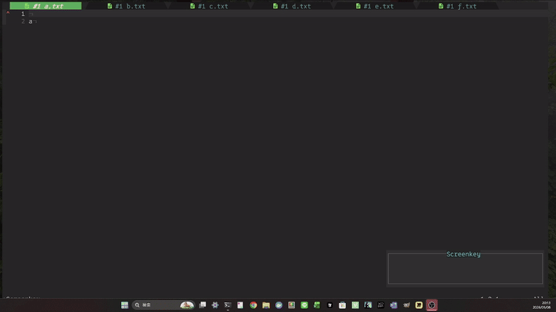

# tabLocalBuffer.nvim

tabLocalBuffer.nvim keeps a per-tab set of buffers so that `bnext` / `bprevious`-style navigation cycles only within that tab.

- Repository: `akasataikisiti/tabLocalBuffer.nvim`
- License: MIT



## Features

- Provides `require("tablocal_buffer").setting(opts)` as the official configuration entry point
- Does not register default keymaps; only keymaps specified in `keymaps` are registered
- Newly opened buffers are automatically assigned to the current tab
- Moves the current buffer to a new tab with `:TabLocalMoveToNewTab`
- Safely detaches only the current buffer with `:TabLocalDetachBuffer` / `:TabLocalWriteDetachBuffer` / `:TabLocalDeleteBuffer`
- Provides a floating editor UI for editing per-tab buffer assignments
- Can use `bufferline.nvim` for global order calculation and sorting when available

## Why?

Neovim's `:bnext` / `:bprevious` navigate through a single global buffer list. When working across multiple tabs — each focused on a different context — you end up cycling through unrelated files. tabLocalBuffer.nvim gives each tab its own buffer list so navigation stays scoped to what's relevant.

## Installation

`lazy.nvim`:

```lua
{
  "akasataikisiti/tabLocalBuffer.nvim",
  config = function()
    require("tablocal_buffer").setting()
  end,
}
```

## Configuration

```lua
require("tablocal_buffer").setting({
  keymaps = {
    bnext = "<S-l>",
    bprevious = "<S-h>",
    move_to_new_tab = "st",
    open_editor = "<M-a>",
  },
  replace_builtin_bnext = false,
  bufferline = {
    enabled = true,
    auto_sort_on_apply = true,
  },
  editor = {
    keymaps = {
      save_and_close = "s",
      add_empty_group = "<C-j>",
      delete_group = "<C-d>",
      dedup_groups = "<C-l>",
    },
  },
  cycle = {
    include_terminal = true,
    require_buflisted = true,
    exclude = {
      unnamed = false,
      filetypes = { "fugitive", "neo-tree" },
      buftypes = { "help", "quickfix", "prompt", "nofile" },
      name_patterns = { "^fugitive://" },
      predicates = {},
    },
  },
})
```

`setup(opts)` is an alias of `setting(opts)`.

Normal `[No Name]` buffers are included in the cycle by default. To exclude them, set `cycle.exclude.unnamed = true`.

### Options

- `commands.enabled` — Whether to define user commands. Default: `true`.
- `replace_builtin_bnext` — Whether to replace `:bnext` / `:bprevious` with `:TabLocalBnext` / `:TabLocalBprevious`. Default: `false`.
- `editor.width_ratio` — Width of the editor UI as a ratio of `vim.o.columns`. Default: `0.6`.
- `editor.height_ratio` — Height of the editor UI as a ratio of `vim.o.lines`. Default: `0.6`.
- `editor.border` — Border style for the editor UI floating window. Default: `"rounded"`.
- `cycle.include_terminal` — Whether to include `buftype == "terminal"` in the cycle. Default: `true`.
- `cycle.require_buflisted` — Whether to include only `buflisted` buffers. Default: `true`.
- `cycle.exclude.unnamed` — Whether to exclude `[No Name]` buffers. Default: `false`.
- `cycle.exclude.filetypes` — List of `filetype` values to exclude. Default: `{ "fugitive" }`.
- `cycle.exclude.buftypes` — List of `buftype` values to exclude. Default: `{}`.
- `cycle.exclude.name_patterns` — Lua patterns matched against buffer names for exclusion. Default: `{ "^fugitive://" }`.
- `cycle.exclude.predicates` — List of `function(ctx)` predicates. A buffer is excluded when any returns `true`. Default: `{}`.

`ctx` fields: `bufnr`, `buflisted`, `buftype`, `filetype`, `bufname`, `modified`.

## Usage

### Editor UI

`:TabLocalEditTabBuffers` opens a floating buffer in a Lua table format. Closing with `q` discards changes. Closing with `s` (or any method other than `q`, such as `:close`) applies the contents.

Each element of `groups` corresponds to one tab's buffer list. `unassigned` holds buffers that do not belong to any tab and are excluded from `bnext` / `bprevious` cycling. Moving a label into `groups` assigns it to that tab.

```lua
return {
  groups = {
    { "init.lua", "README.md" },
    { "main.ts", "test.ts" },
  },
  unassigned = {
    "scratch.txt:18",
  },
}
```

### Detaching Buffers

The behavior of `:q` / `:wq` / `:bd` is unchanged. Use these commands to detach only the current buffer from its tab assignment:

- `:TabLocalDetachBuffer` — Remove from the current tab's list, leave unassigned.
- `:TabLocalWriteDetachBuffer` — Run `:write`, then remove from the current tab's list.
- `:TabLocalDeleteBuffer` — Remove from the current tab's list, then delete the buffer.

## Commands

- `:TabLocalBnext`
- `:TabLocalBprevious`
- `:TabLocalEditTabBuffers`
- `:TabLocalBufferlineSort`
- `:TabLocalMoveToNewTab`
- `:TabLocalDetachBuffer`
- `:TabLocalWriteDetachBuffer`
- `:TabLocalDeleteBuffer`
- `:TabLocalDebugState`

## Keymaps

No keymaps are registered by default. Specify them via the `keymaps` option.

- `keymaps.bnext` — Next tab-local buffer.
- `keymaps.bprevious` — Previous tab-local buffer.
- `keymaps.move_to_new_tab` — Move current buffer to a new tab.
- `keymaps.open_editor` — Open the editor UI.
- `editor.keymaps.save_and_close` — Apply the editor UI contents and close it. Default: `"s"`. Set to `""` to disable. `q` is reserved for closing without saving.
- `editor.keymaps.add_empty_group` — Insert an empty group after the cursor's group in the editor UI. Default: `"<C-j>"`. Set to `""` to disable.
- `editor.keymaps.delete_group` — Delete the group at the cursor in the editor UI. Default: `"<C-d>"`. Set to `""` to disable.
- `editor.keymaps.dedup_groups` — Remove duplicate buffer entries across groups, keeping each buffer only in the first group it appears in. Empty groups resulting from deduplication are removed. Default: `"<C-l>"`. Set to `""` to disable. Note: `<C-l>` overrides Neovim's built-in `nohlsearch|diffupdate` action inside the editor.

## Bufferline Integration

When `bufferline.nvim` is installed, tabLocalBuffer.nvim can use its global buffer order for sorting.

- `bufferline.enabled` — Enable `bufferline.nvim` integration. Default: `true`.
- `bufferline.auto_sort_on_apply` — Automatically sort after applying the editor UI. Default: `true`.

Use `:TabLocalBufferlineSort` to trigger sorting manually.

### Showing Tab Numbers

Combine `name_formatter` with `tablocal_buffer.get_buf_tabnr()` to display the tab number for each buffer in bufferline (e.g. `#1 init.lua`).

```lua
bufferline.setup({
  options = {
    name_formatter = function(buf)
      local ok, tablocal = pcall(require, "tablocal_buffer")
      if not ok then return buf.name end
      local tnr = tablocal.get_buf_tabnr(buf.bufnr)
      if tnr then
        return string.format("#%d %s", tnr, buf.name)
      end
      return buf.name
    end,
  },
})
```

## License

MIT License. See [LICENSE](LICENSE).
